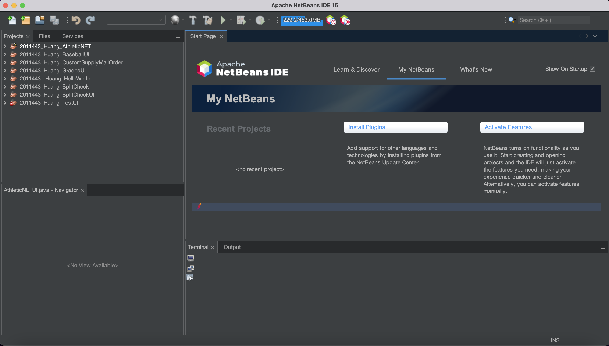
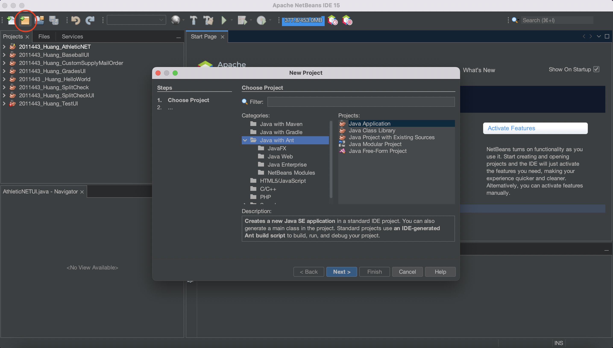
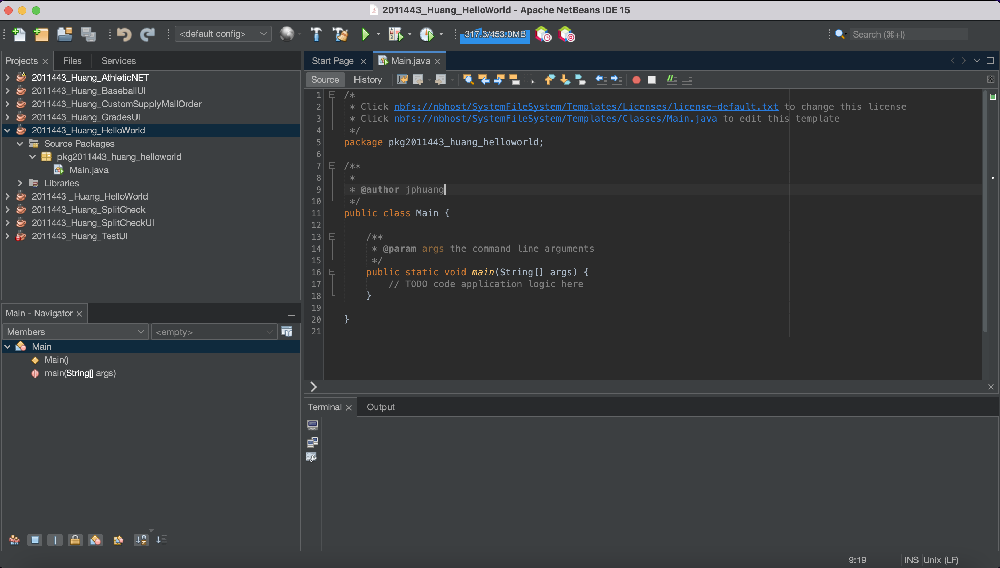

# Creating a Java Project

After opening up Netbeans, you should see a screen like the image below.

Then, you'll create a new Java Application from the Java with Ant category. The reason why we're using Ant is that it provides a very flexible way to build Java applications, and allows us to easily use graphical user interfaces (GUI). (And also because of legacy - every developer's favorite cause ;) )

Hit next and give your project an appropriate name and location, then make sure the `Create Main Class` box is checked.
(For the IB CS class, we typically follow the convention `ID_LastName_ProjectTitle` for a project name).

After the previous steps, your screen should look something like this.

Great! Now let's get into the code and code-running. 🏃
